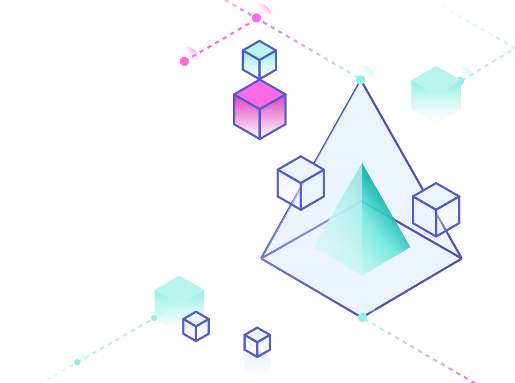

  
  
  

<!-- PROJECT LOGO -->
 

  

<h3 align="center">Hello Prisma Tutorial</h3>
<h4><i>Prisma Documentation</i></h4>

  

    Learn how to create a new Node.js or TypeScript project from scratch by connecting Prisma to your MongoDB database and generating a Prisma Client for database access. The following tutorial introduces you to the Prisma CLI and Prisma Client.
  

<!-- LICENSE -->
## License

Distributed under the MIT License. See `LICENSE.txt` for more information.
